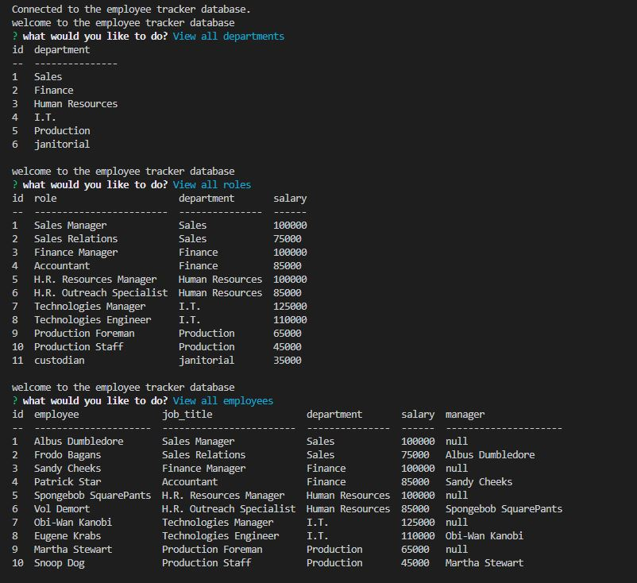

# Employee Tracker

## Description

A command-line application that manages a company's employee database.

## Built With

- Node.js
- Inquirer
- MySQL

## Installation

1. Clone the repo using `git clone`
2. Navigate to the app directory
3. Run `npm install` to install dependencies
4. Run `npm start` in the command line to launch the application

## Demo

